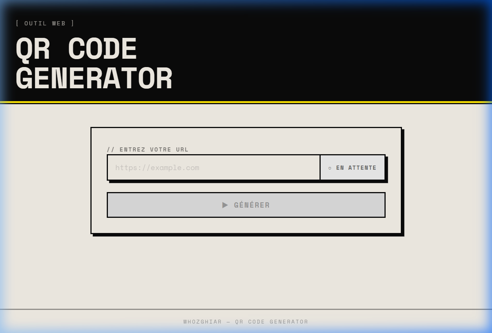
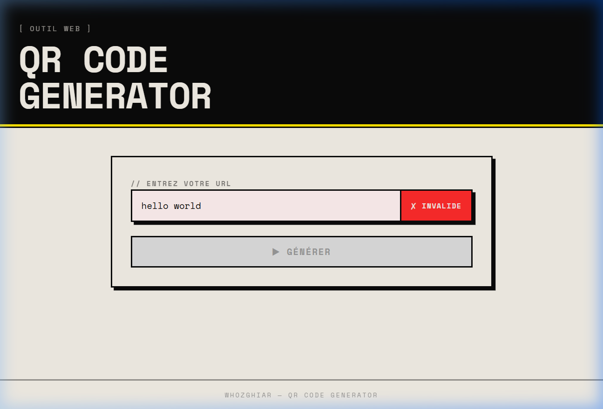
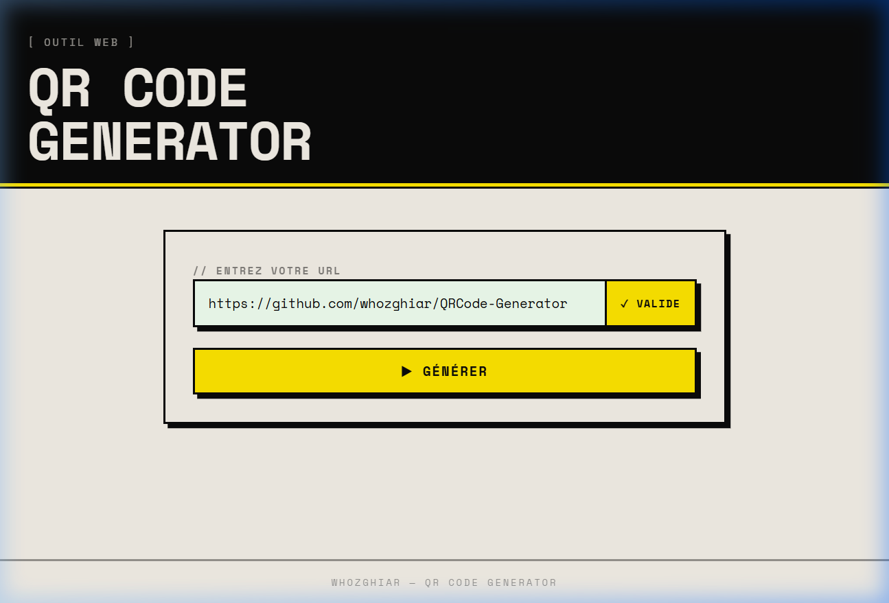
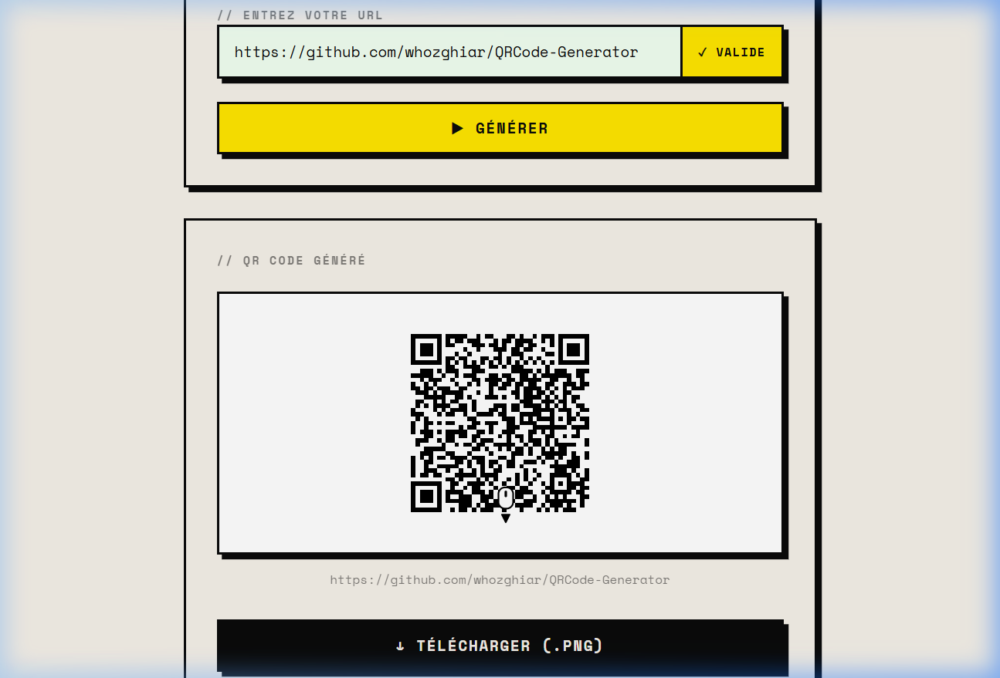

# QR Code Generator

Générateur de QR code en ligne — entrez une URL, obtenez instantanément votre QR code et téléchargez-le en PNG.

---

## Table des matières

- [Guide utilisateur](#guide-utilisateur)
- [Guide développeur](#guide-développeur)
  - [Prérequis et installation](#prérequis-et-installation)
  - [Architecture du projet](#architecture-du-projet)
  - [Backend Flask](#backend-flask)
  - [Frontend VueJS](#frontend-vuejs)
  - [Validation des URL](#validation-des-url)

---

## Guide utilisateur

L'application est accessible via votre navigateur web. Aucune installation n'est requise de votre côté.

### 1. Page d'accueil

À l'ouverture, un champ de saisie s'affiche. Le bouton **▶ GÉNÉRER** est grisé tant qu'aucune URL valide n'a été saisie.



---

### 2. Saisir une URL invalide

Si le texte saisi ne correspond pas à une URL reconnue, le badge passe en rouge **✗ INVALIDE** et le bouton reste inaccessible.



---

### 3. Saisir une URL valide

Dès qu'une URL valide est saisie, le badge passe en jaune **✓ VALIDE** et le bouton **▶ GÉNÉRER** s'active.



---

### 4. Générer et télécharger le QR code

Cliquez sur **▶ GÉNÉRER**. Le QR code apparaît en quelques instants.
Cliquez ensuite sur **↓ TÉLÉCHARGER (.PNG)** pour sauvegarder l'image sur votre appareil.



---

## Guide développeur

### Prérequis et installation

**Prérequis :** Python 3.x et Node.js installés sur la machine.

**1. Installer les dépendances Python (une seule fois) :**

```bash
cd backend
pip install -r requirements.txt
```

**2. Installer les dépendances Node.js (une seule fois) :**

```bash
cd frontend
npm install
```

**3. Lancer les deux serveurs (deux terminaux distincts) :**

| Terminal | Commande | Rôle |
|---|---|---|
| Terminal 1 | `cd backend && python app.py` | Serveur API Flask — port **5000** |
| Terminal 2 | `cd frontend && npm run dev` | Interface web Vite — port **5173** |

**4. Ouvrir l'application dans le navigateur :**

```
http://localhost:5173
```

---

### Architecture du projet

```
QRCode-Generator/
│
├── .gitignore
├── README.MD
│
├── backend/                 # Serveur API Python
│   ├── app.py               # Application Flask (endpoint unique)
│   └── requirements.txt     # Dépendances Python
│
├── frontend/                # Interface web VueJS
│   ├── index.html           # Point d'entrée HTML
│   ├── vite.config.js       # Configuration Vite (proxy /api → Flask)
│   ├── package.json         # Dépendances Node.js
│   └── src/
│       ├── main.js          # Montage de l'application Vue
│       ├── style.css        # Styles globaux (design brutaliste)
│       └── App.vue          # Composant principal (logique + template)
│
└── docs/
    └── screenshots/         # Captures d'écran de la documentation
```

---

### Backend Flask

**Fichier :** `backend/app.py`

Le backend expose un unique endpoint REST :

| Méthode | Route | Description |
|---|---|---|
| `POST` | `/api/generate` | Génère un QR code à partir d'une URL |

**Corps de la requête (JSON) :**
```json
{ "url": "https://github.com/whozghiar/QRCode-Generator" }
```

**Réponses :**
```json
// Succès (200)
{ "image": "data:image/png;base64,..." }

// Erreur (400)
{ "error": "URL invalide" }
```

**Dépendances Python :**

| Paquet | Rôle |
|---|---|
| `flask` | Serveur web et routage |
| `flask-cors` | Autorise les requêtes cross-origin du frontend (port 5173) |
| `pyqrcode` | Génération du QR code en mémoire |
| `pypng` | Encodage de l'image en PNG |

---

### Frontend VueJS

**Fichier :** `frontend/src/App.vue`

Composant unique gérant l'intégralité de l'interface :

| Réf. Vue | Type | Rôle |
|---|---|---|
| `url` | `ref` | Valeur saisie dans le champ URL |
| `qrImage` | `ref` | Image base64 reçue du backend |
| `loading` | `ref` | État pendant l'appel API |
| `error` | `ref` | Message d'erreur éventuel |
| `isValid` | `computed` | `true` si l'URL passe la regex |
| `statusLabel` | `computed` | Texte du badge de validation |

Le proxy Vite (`vite.config.js`) redirige tous les appels `/api/*` vers `http://localhost:5000`, éliminant ainsi tout problème CORS en développement.

---

### Validation des URL

La validation est effectuée **côté frontend** (réactivité immédiate) **et côté backend** (sécurité), avec la même expression régulière :

```
^(https?://)?(([a-zA-Z0-9\-]+\.)+[a-zA-Z]{2,})([/?#].*)?$
```

| Partie | Description |
|---|---|
| `^(https?://)?` | Protocole HTTP/HTTPS optionnel |
| `(([a-zA-Z0-9\-]+\.)+` | Un ou plusieurs labels (alphanum + tirets) séparés par des points |
| `[a-zA-Z]{2,})` | TLD obligatoire d'au moins 2 lettres (`.com`, `.site`, `.fr`…) |
| `([/?#].*)?$` | Chemin, query string ou fragment optionnels |

**Exemples d'URL valides :**
- `https://github.com/whozghiar/QRCode-Generator` ✅
- `https://some-project.my.canva.site/page` ✅ (tirets + sous-domaines multiples)
- `google.fr`
- `http://www.example.co.uk/page?q=test`

**Exemples d'URL invalides :**
- `hello world` (espace interdit)
- `localhost` (pas de TLD)
- `ftp://example.com` (protocole non HTTP)

---

## Auteur

[Whozghiar](https://github.com/whozghiar)
